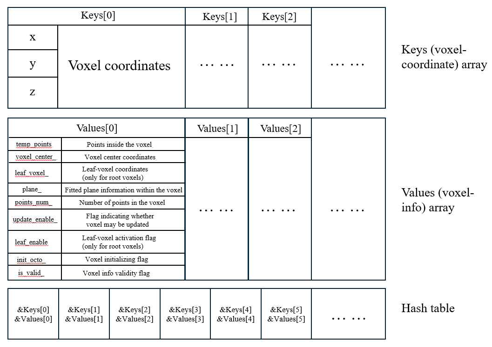
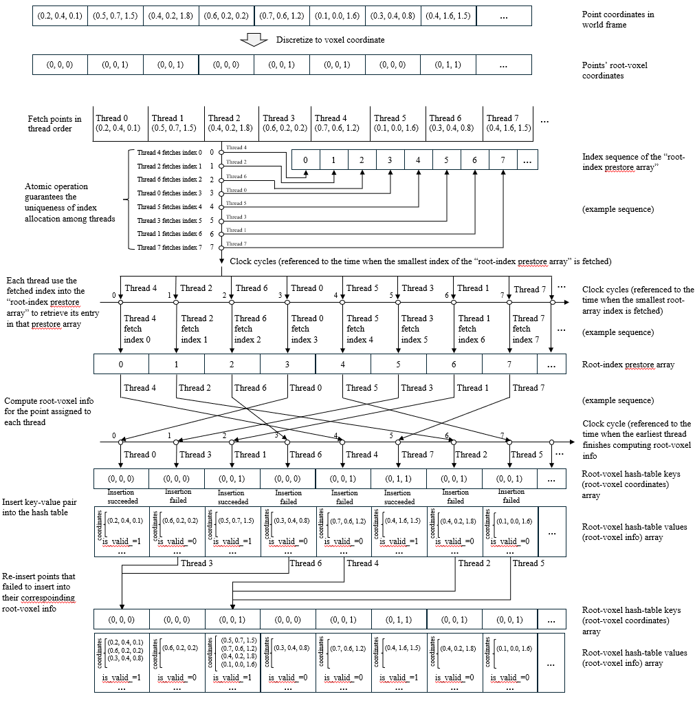
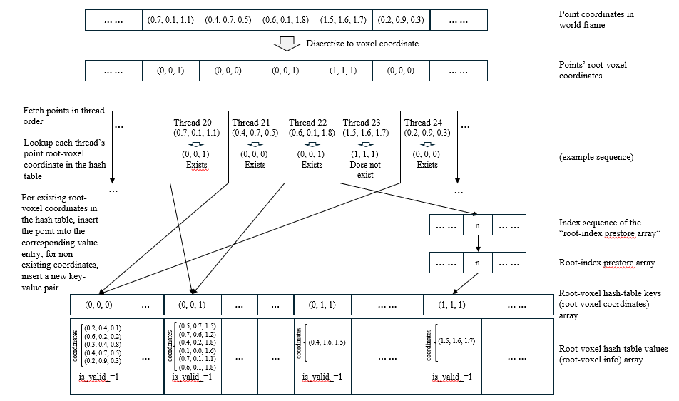
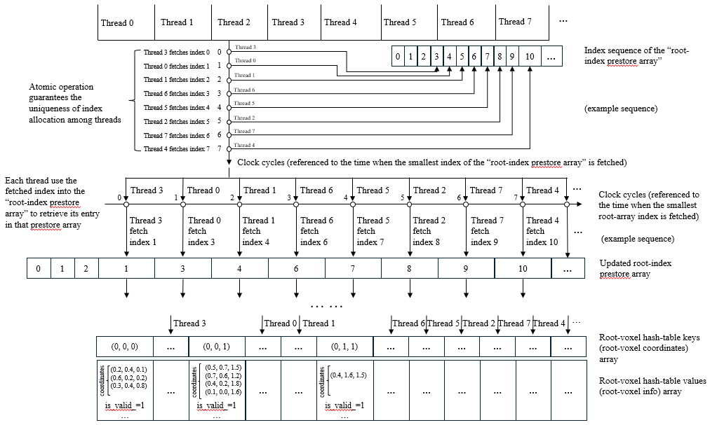
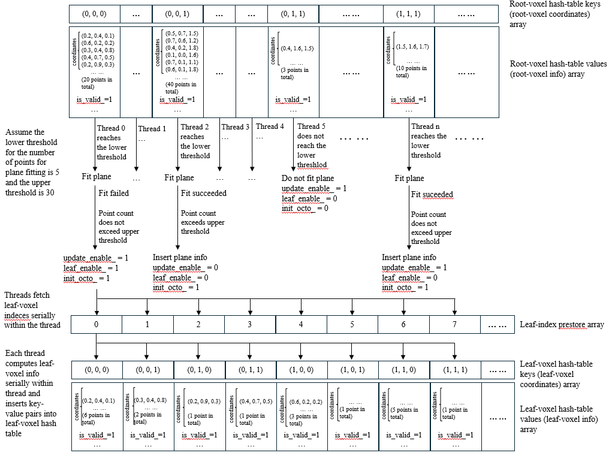
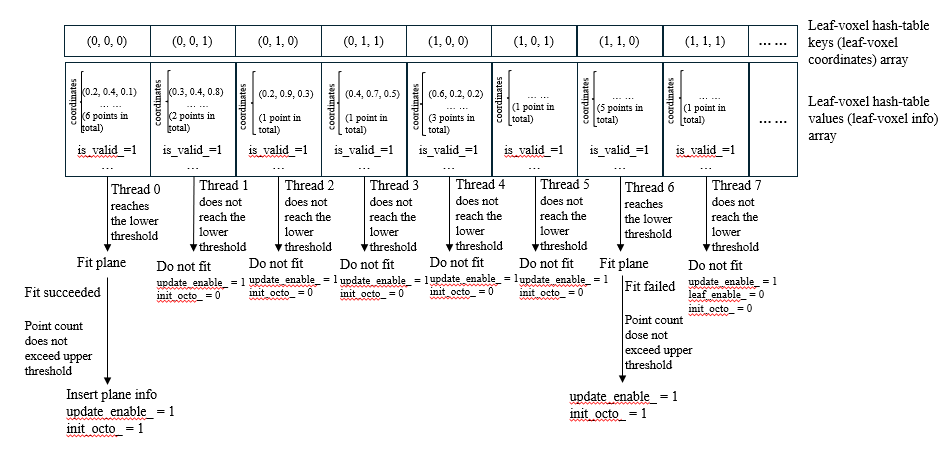

# CuHashSLAM (based on FAST-LIVO2)

## CuHashSLAM: GPU-Accelerated LiDAR-IMU SLAM with Parallel Voxel Hash Tables (based on FAST-LIVO2)

## 1. Overview

This project implements a fast, GPU-accelerated LiDAR–IMU SLAM system using a CUDA-parallel hash-table voxel map. We build on the [**FAST-LIVO2**](https://github.com/hku-mars/FAST-LIVO2) framework (a fast, direct LiDAR–inertial–visual odometry system) and thank its authors for their original work. Like FAST-LIVO2, our method uses tightly-coupled LiDAR and IMU fusion in an iterated Kalman filter, but we offload the voxel map construction and point-to-plane matching to the GPU for speed. NVIDIA's recent [**cuCollections**](https://github.com/NVIDIA/cuCollections) library (an open-source CUDA C++ library of data structures, including hash maps) is used to implement the hash tables: in particular, we use `cuco::static_map`, a fixed-size hash table with open addressing, to store root and leaf voxels on the GPU. This allows many threads to concurrently insert and query voxels, greatly speeding up large-scale point-cloud processing.

## 2. Key Issues to Note

- Based on [**FAST-LIVO2**](https://github.com/hku-mars/FAST-LIVO2): Our code extends the FAST-LIVO2 GitHub repository. We explicitly acknowledge and thank the FAST-LIVO2 authors for their publicly released algorithm, which we use as the baseline. Our modifications focus on GPU acceleration of the LiDAR–IMU pipeline, while keeping the core estimation framework (error-state iterated Kalman filter, map representation, etc.) the same as in FAST-LIVO2. All the mathematical foundations and formulas are unchanged from FAST-LIVO2, so we do not repeat them here. Instead, we detail how each step is implemented using the GPU hash tables (instead of CPU data structures).
- LiDAR–IMU only: Currently only the LiDAR–IMU parts of the system are GPU-accelerated. The visual (camera) component from FAST-LIVO2 is unmodified and still runs on the CPU. In practice, to run the full system end-to-end, the voxel map must be copied between GPU and CPU. These memory transfers incur significant latency, so the present implementation is intended as a proof of concept, not a drop-in real-time system. In other words, one would need to transfer the GPU-resident map back to CPU memory for use by the visual odometry module, which is slow. We highlight that our project demonstrates the idea of a GPU-accelerated voxel map for SLAM, rather than a fully optimized complete SLAM package.
- CUDA Hash Table ([**cuCollections**](https://github.com/NVIDIA/cuCollections)): We employ NVIDIA's cuCollections library, using its `cuco::static_map` container to represent the voxel map on the GPU. As noted in NVIDIA's documentation, static_map is a fixed-size hash table using open addressing (linear probing). This lets us pre-allocate two hash tables in GPU memory (one for “root” voxels and one for “leaf” voxels) and perform fast parallel insertions and lookups with CUDA kernels. Because cuCollections is a new project (released in 2023), it is still evolving; we found that the library's rapid updates sometimes cause build or deployment issues. Users should be aware that compatibility problems may arise if the cuCollections version changes.

<figure>
  
  <figcaption><strong>Figure 1.</strong> Voxel-map keys (voxel-coordinate) array, values (voxel-info) array, and hash-table schematic.</figcaption>
</figure>
  

- Testing Platform and Compatibility: We have tested our implementation on a desktop with an Intel i7-12700KF CPU, 32 GB RAM, and an NVIDIA GTX 1070 GPU (8 GB). On this setup, the GPU-accelerated components run correctly. We attempted to run the code on other hardware (newer GPUs) but encountered failures, likely due to architectural differences. Users should note that GPU architecture may affect whether the code runs without errors.
- Files: The core changes we made are located in the files voxel_map_cuda.cu and voxel_map_cuda.h (which implement the CUDA hash-table operations) and a few added lines in LIVMapper.cpp.

## 3. CUDA Hash Table

We pre-allocate two `cuco::static_map` tables on the GPU – one for root voxels and one for leaf voxels. In addition to the hash tables we allocate parallel device arrays for keys (3-D voxel coordinates) and values (voxel payloads such as aggregated-point statistics and fitted plane parameters). A few implementation details important for correctness and performance:
- Static_map Key/Value Size Constraint: `cuco::static_map` requires that each stored key and each stored value fit within 8 bytes. To accommodate full voxel keys/values that exceed 8 bytes, we do not store the full data inside the hash entries. Instead, we store addresses in the hash table that point into the separate, pre-allocated key and value arrays. Concretely: the hash table entries contain the address of the corresponding element, while the actual key (e.g., 3×int64 voxel coordinate) and the full value struct (per-voxel aggregates, plane parameters, flags, etc.) reside in the two parallel arrays on the device.
- One Hash Table per Voxel Level (two levels only): Unlike the original CPU design that used a single unordered_map to hold multiple voxel levels, this project creates one static_map per voxel level to enable fully parallel operations on each level without cross-level contention. We restrict the design to two voxel levels only: one root level and one leaf level (coarse → fine). This simplifies parallel kernels and avoids interleaved concurrency issues that would arise if multiple levels were stored in the same hash structure.
- Preallocation & Capacity Sizing: `cuco::static_map` does not support convenient dynamic resizing on the device; its capacity must be chosen and allocated up front. Therefore the GPU hash tables and their associated key/value arrays must be preallocated with sufficient capacity to avoid overflows at runtime. In this prototype we set the capacity for both the root and leaf tables — and for their corresponding keys and values arrays — to 20,000 entries each. This static sizing trades flexibility for predictable performance and simpler concurrent allocation logic; users should adjust these sizes based on their dataset density and available GPU memory.

## 4. Algorithm Implementation

### 4.1 Voxel Map Construction

At the first LiDAR frame, we build a voxelized map in GPU memory.A CUDA kernel launches one thread per downsampled LiDAR point from the current scan. Each thread computes the root-voxel coordinate of its point (by discretizing the point’s 3D position). Then the thread attempts to insert or lookup that key in the root static_map:
- New voxel insertion: If the key is not already present, the thread uses an atomic counter to reserve a unique index in the key/value arrays. This avoids write conflicts: each inserting thread gets a different index. The thread then writes the voxel’s coordinate into the keys array and the point’s information into the values array at that index, and finally inserts the key–value pair into the hash table. If multiple threads race to insert the same key, only one will succeed; the others will detect the collision on insertion and retry the lookup.
- Existing voxel update: If the hash lookup finds that the root voxel key already exists (either originally or because another thread just inserted it), the thread simply appends its point to that voxel’s data (updating a point count and sum in the value array). No new entry is created in this case.

<figure>
  
  <figcaption><strong>Figure 2.</strong> Illustration of root-voxel map construction under thread contention (example with 8 threads).</figcaption>
</figure>
  

<figure>
  
  <figcaption><strong>Figure 3.</strong> Illustration of root-voxel map construction without thread contention (example with 5 threads).</figcaption>
</figure>
  

Because each inserter thread reserves a unique index in the key/value arrays using an atomic counter before attempting to insert the corresponding key into the static_map, it is possible that a thread will reserve (and write to) an array slot but then fail to install the hash entry (for example, because another thread inserted the same key first). In that case the reserved array slot becomes temporarily occupied but logically invalid. To avoid leaking these slots permanently, we reclaim them in a later cleanup phase using the following scheme:
- every value entry contains an is_valid_ flag that is set to 1 only after the thread successfully inserts the key-value pair into the static_map; if insertion fails, the thread either leaves is_valid_=0;
- during the map updating kernel, GPU threads scan the key/value arrays and collect indices where is_valid==0 into a device-side free list (also managed with atomic push operations); (performed in 4.3)
- subsequent insertions first try to pop an index from the free list (atomic pop) before using the global atomic counter, thereby re-using reclaimed slots and limiting array fragmentation. (performed in 4.3)
This reclamation loop (mark invalid → collect into free list → reuse indices) keeps the arrays reusable across frames and avoids unbounded consumption of preallocated capacity.

<figure>
  
  <figcaption><strong>Figure 4.</strong> Illustration of invalid root-voxel key/value-index reclamation and hash-table update process.</figcaption>
</figure>
  

After building the root map, we launch one thread per root voxel to attempt a plane fit: if a root voxel has enough points (above a minimum), we compute a best-fit plane; if the fit fails (high error) and the point count is above a threshold, we subdivide that voxel into 8 leaf voxels, inserting these new keys into the leaf static_map and redistributing the points. This partitioning step also runs on the GPU, with threads splitting or fitting voxels in parallel.

<figure>
  
  <figcaption><strong>Figure 5.</strong> Illustration of plane fitting inside a root voxel and subdivision into leaf voxels.</figcaption>
</figure>
  

<figure>
  
  <figcaption><strong>Figure 6.</strong> Illustration of leaf-voxel plane-fitting process.</figcaption>
</figure>
  

### 4.2 State Estimation

Once the voxel map (root + leaf) is built, we perform pose update using the iterated Kalman filter (ESIKF) as in FAST-LIVO2. The difference is in how point-to-plane correspondences are found: we launch one thread per point of the current LiDAR scan. Each thread looks up its point’s root voxel key in the GPU hash tables:
- If the root voxel has a fitted plane, we project the point onto that plane.
- If the root voxel has no plane but the point’s leaf voxel exists and has a plane, we use the leaf plane.
- Otherwise (no plane found), the point is skipped.

### 4.3 Map Update

After updating the state, we must integrate the new frame into the map. First, we recycle invalid voxels (is_valid_==0). Then we repeat the 4.1 process with the new LiDAR frame’s points, inserting or updating voxels in the same two hash tables.

### 4.4 Sliding-Window Cleaning

The sliding-window cleaning step follows the same logic as the original algorithm. The key difference in our GPU implementation is how deletion and memory reclamation are handled to avoid unsafe concurrent frees on device memory. When a root voxel is selected for removal, we do not immediately reclaim its preallocated array slots. Instead, we mark the corresponding entries in the root-value array and any associated leaf-value array entries by setting their is_valid_ flags to 0. The actual reclamation of those array slots is deferred and performed during the next map update pass (4.3). This deferred-reclamation strategy avoids race conditions and simplifies parallel memory management on the GPU while preserving the same semantic behavior as the original sliding-window deletion policy.

